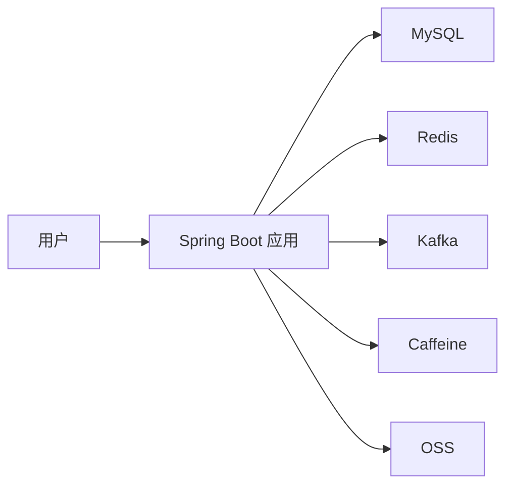

# 知光平台后端 `zg_be`

一个面向内容社区场景的后端项目，基于 `Spring Boot 3 + Java 21` 构建，围绕认证体系、内容发布、用户关系、互动计数与内容检索等核心能力进行设计与实现。

## 项目亮点

- 基于 `JWT 双令牌 + Redis` 实现登录、续期与退出登录，兼顾安全性与分布式场景下的登录态管理。
- 围绕点赞、收藏、关注等高频互动行为，设计统一计数模型，并结合 `Redis + Kafka` 实现异步解耦与最终一致性处理。
- 通过 `Caffeine + Redis` 构建多级缓存，配合热点探测与过期策略，降低高频访问场景下的数据库压力。
- 支持内容发布、Feed 流、关注关系、对象存储直传等完整社区主链路。
- 在基础社区能力上扩展了内容摘要与知识问答能力，提升内容消费体验。

## 核心功能

- 注册、登录、登出、刷新令牌
- 验证码发送与密码重置
- 用户资料维护与头像上传
- 内容草稿、发布、详情查询、Feed 流
- 关注 / 取关 / 粉丝列表 / 关注列表
- 点赞 / 收藏 / 计数查询
- 内容搜索与建议
- OSS 预签名上传

## 技术栈

- `Java 21`
- `Spring Boot 3`
- `Spring Security`
- `MyBatis`
- `MySQL`
- `Redis`
- `Kafka`
- `Caffeine`
- `Alibaba Cloud OSS`

> 注：仓库中包含搜索与 AI 相关扩展能力，但项目展示主线聚焦在认证、内容、关系和计数系统。

## 业务架构



## 核心链路

### 1. 认证链路

- 验证码登录与账号密码登录
- Access Token / Refresh Token 双令牌机制
- Refresh Token 存储在 Redis 中，支持续期与撤销

### 2. 内容发布链路

- 创建草稿
- 更新元数据
- 上传资源并确认
- 发布内容
- 进入 Feed 流与详情页展示

### 3. 互动计数链路

- 点赞、收藏、关注等行为统一抽象为计数事件
- 热数据优先落 Redis
- 通过 Kafka 异步解耦计数更新与持久化逻辑

## 关键设计

### 1. 双令牌认证体系

- 使用 Spring Security 统一处理认证授权流程
- Access Token 用于接口鉴权，Refresh Token 用于续期与退出控制
- Redis 保存登录态相关信息，减少无状态 JWT 难以主动失效的问题

### 2. 关系与计数系统

- 将关注关系与互动计数拆分为独立模块，减少业务耦合
- 通过异步消息驱动更新聚合数据，提高系统扩展性
- 针对重复操作与并发更新场景预留幂等处理空间

### 3. 多级缓存设计

- 本地缓存 Caffeine 优先拦截热点读取
- Redis 作为分布式缓存共享热点数据
- 通过多级缓存减少数据库回源，提升接口响应稳定性

## 项目结构

```text
zg_be
├─ auth        # 认证与令牌体系
├─ profile     # 用户资料
├─ knowpost    # 内容发布与 Feed
├─ relation    # 用户关系
├─ counter     # 点赞/收藏等计数系统
├─ storage     # OSS 存储能力
├─ cache       # 缓存配置与热点处理
└─ common      # 通用异常、工具类与 Web 封装
```

## 本地运行

### 环境要求

- JDK 21
- Maven 3.9+
- MySQL 8
- Redis
- Kafka

### 启动步骤

1. 创建数据库并执行 `db/schema.sql`
2. 在 `src/main/resources/application.yml` 中补充本地配置
3. 启动 MySQL、Redis、Kafka
4. 执行：

```bash
mvn -DskipTests spring-boot:run
```

## 快速验证

- 登录接口：验证双令牌认证与刷新逻辑
- 内容发布接口：验证草稿、发布、详情查询主链路
- 关注与计数接口：验证互动行为与异步更新链路

## 项目定位

## 项目定位

这是一个面向内容社区场景的后端项目，围绕认证、内容发布、用户关系、互动计数与缓存优化等核心问题进行设计与实现，重点关注高频互动场景下的系统解耦与读写性能。
